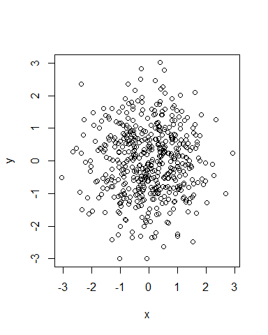

RMarkdown01
================

-   use markdown files for Github
-   ctrl + alt + i to insert a code chunk
-   put a comma after r to set how the run will load

``` r
x <- rnorm(500)
y <- rnorm(500) 

plot (x, y)
```



R Markdown
----------

This is an R Markdown document. Markdown is a simple formatting syntax for authoring HTML, PDF, and MS Word documents. For more details on using R Markdown see <http://rmarkdown.rstudio.com>.

When you click the **Knit** button a document will be generated that includes both content as well as the output of any embedded R code chunks within the document. You can embed an R code chunk like this:

``` r
summary(cars)
```

    ##      speed           dist       
    ##  Min.   : 4.0   Min.   :  2.00  
    ##  1st Qu.:12.0   1st Qu.: 26.00  
    ##  Median :15.0   Median : 36.00  
    ##  Mean   :15.4   Mean   : 42.98  
    ##  3rd Qu.:19.0   3rd Qu.: 56.00  
    ##  Max.   :25.0   Max.   :120.00

Including Plots
---------------

You can also embed plots, for example:

 \#plot run

Note that the `echo = FALSE` parameter was added to the code chunk to prevent printing of the R code that generated the plot.

cm005
=====

``` r
library(gapminder)
library (tidyverse)
```

    ## Loading tidyverse: ggplot2
    ## Loading tidyverse: tibble
    ## Loading tidyverse: tidyr
    ## Loading tidyverse: readr
    ## Loading tidyverse: purrr
    ## Loading tidyverse: dplyr

    ## Conflicts with tidy packages ----------------------------------------------

    ## filter(): dplyr, stats
    ## lag():    dplyr, stats

``` r
##How many variables (columns) are in the iris dataset, and what are their names?
str(iris)
```

    ## 'data.frame':    150 obs. of  5 variables:
    ##  $ Sepal.Length: num  5.1 4.9 4.7 4.6 5 5.4 4.6 5 4.4 4.9 ...
    ##  $ Sepal.Width : num  3.5 3 3.2 3.1 3.6 3.9 3.4 3.4 2.9 3.1 ...
    ##  $ Petal.Length: num  1.4 1.4 1.3 1.5 1.4 1.7 1.4 1.5 1.4 1.5 ...
    ##  $ Petal.Width : num  0.2 0.2 0.2 0.2 0.2 0.4 0.3 0.2 0.2 0.1 ...
    ##  $ Species     : Factor w/ 3 levels "setosa","versicolor",..: 1 1 1 1 1 1 1 1 1 1 ...

``` r
#How many rows are in the data set?
nrow(iris)
```

    ## [1] 150

``` r
#What are the smallest values of each numeric variable?
summary(iris)
```

    ##   Sepal.Length    Sepal.Width     Petal.Length    Petal.Width   
    ##  Min.   :4.300   Min.   :2.000   Min.   :1.000   Min.   :0.100  
    ##  1st Qu.:5.100   1st Qu.:2.800   1st Qu.:1.600   1st Qu.:0.300  
    ##  Median :5.800   Median :3.000   Median :4.350   Median :1.300  
    ##  Mean   :5.843   Mean   :3.057   Mean   :3.758   Mean   :1.199  
    ##  3rd Qu.:6.400   3rd Qu.:3.300   3rd Qu.:5.100   3rd Qu.:1.800  
    ##  Max.   :7.900   Max.   :4.400   Max.   :6.900   Max.   :2.500  
    ##        Species  
    ##  setosa    :50  
    ##  versicolor:50  
    ##  virginica :50  
    ##                 
    ##                 
    ## 

``` r
#Extract the Petal.Width column to get a vector of observations (we’ll see vectors in more detail in a later class), and
petalwidth <- iris$Petal.Width
#Make a histogram
hist(petalwidth)
```


``` r
#Make a table of frequencies
table(iris$Petal.Width, iris$Species)
```

    ##      
    ##       setosa versicolor virginica
    ##   0.1      5          0         0
    ##   0.2     29          0         0
    ##   0.3      7          0         0
    ##   0.4      7          0         0
    ##   0.5      1          0         0
    ##   0.6      1          0         0
    ##   1        0          7         0
    ##   1.1      0          3         0
    ##   1.2      0          5         0
    ##   1.3      0         13         0
    ##   1.4      0          7         1
    ##   1.5      0         10         2
    ##   1.6      0          3         1
    ##   1.7      0          1         1
    ##   1.8      0          1        11
    ##   1.9      0          0         5
    ##   2        0          0         6
    ##   2.1      0          0         6
    ##   2.2      0          0         3
    ##   2.3      0          0         8
    ##   2.4      0          0         3
    ##   2.5      0          0         3

2.2. dplyr fundamentals
=======================

``` r
filter(gapminder, country=="Canada" & year >1970) #use the filter to choose your data
```

    ## # A tibble: 8 x 6
    ##   country continent  year lifeExp      pop gdpPercap
    ##    <fctr>    <fctr> <int>   <dbl>    <int>     <dbl>
    ## 1  Canada  Americas  1972  72.880 22284500  18970.57
    ## 2  Canada  Americas  1977  74.210 23796400  22090.88
    ## 3  Canada  Americas  1982  75.760 25201900  22898.79
    ## 4  Canada  Americas  1987  76.860 26549700  26626.52
    ## 5  Canada  Americas  1992  77.950 28523502  26342.88
    ## 6  Canada  Americas  1997  78.610 30305843  28954.93
    ## 7  Canada  Americas  2002  79.770 31902268  33328.97
    ## 8  Canada  Americas  2007  80.653 33390141  36319.24

``` r
#Find all entries of Canada and Algeria.
filter(gapminder, country %in% c("Canada", "Algeria"))
```

    ## # A tibble: 24 x 6
    ##    country continent  year lifeExp      pop gdpPercap
    ##     <fctr>    <fctr> <int>   <dbl>    <int>     <dbl>
    ##  1 Algeria    Africa  1952  43.077  9279525  2449.008
    ##  2 Algeria    Africa  1957  45.685 10270856  3013.976
    ##  3 Algeria    Africa  1962  48.303 11000948  2550.817
    ##  4 Algeria    Africa  1967  51.407 12760499  3246.992
    ##  5 Algeria    Africa  1972  54.518 14760787  4182.664
    ##  6 Algeria    Africa  1977  58.014 17152804  4910.417
    ##  7 Algeria    Africa  1982  61.368 20033753  5745.160
    ##  8 Algeria    Africa  1987  65.799 23254956  5681.359
    ##  9 Algeria    Africa  1992  67.744 26298373  5023.217
    ## 10 Algeria    Africa  1997  69.152 29072015  4797.295
    ## # ... with 14 more rows

``` r
#Find all entries of Canada and Algeria, occuring in the ’60s.
filter(gapminder, country %in% c("Canada", "Algeria"), year >=1960 & year < 1970)
```

    ## # A tibble: 4 x 6
    ##   country continent  year lifeExp      pop gdpPercap
    ##    <fctr>    <fctr> <int>   <dbl>    <int>     <dbl>
    ## 1 Algeria    Africa  1962  48.303 11000948  2550.817
    ## 2 Algeria    Africa  1967  51.407 12760499  3246.992
    ## 3  Canada  Americas  1962  71.300 18985849 13462.486
    ## 4  Canada  Americas  1967  72.130 20819767 16076.588

``` r
#Find all entries of Canada, and entries of Algeria occuring in the ’60s.
filter(gapminder, (country =="Canada")| (country == "Algeria"& year >=1960 & year < 1970))
```

    ## # A tibble: 14 x 6
    ##    country continent  year lifeExp      pop gdpPercap
    ##     <fctr>    <fctr> <int>   <dbl>    <int>     <dbl>
    ##  1 Algeria    Africa  1962  48.303 11000948  2550.817
    ##  2 Algeria    Africa  1967  51.407 12760499  3246.992
    ##  3  Canada  Americas  1952  68.750 14785584 11367.161
    ##  4  Canada  Americas  1957  69.960 17010154 12489.950
    ##  5  Canada  Americas  1962  71.300 18985849 13462.486
    ##  6  Canada  Americas  1967  72.130 20819767 16076.588
    ##  7  Canada  Americas  1972  72.880 22284500 18970.571
    ##  8  Canada  Americas  1977  74.210 23796400 22090.883
    ##  9  Canada  Americas  1982  75.760 25201900 22898.792
    ## 10  Canada  Americas  1987  76.860 26549700 26626.515
    ## 11  Canada  Americas  1992  77.950 28523502 26342.884
    ## 12  Canada  Americas  1997  78.610 30305843 28954.926
    ## 13  Canada  Americas  2002  79.770 31902268 33328.965
    ## 14  Canada  Americas  2007  80.653 33390141 36319.235

``` r
#also: filter(gapminder, (country =="Canada")| (country == "Algeria"& year %in% 1960:1969)) 

#Find all entries not including European countries.
filter(gapminder, continent != "Europe")
```

    ## # A tibble: 1,344 x 6
    ##        country continent  year lifeExp      pop gdpPercap
    ##         <fctr>    <fctr> <int>   <dbl>    <int>     <dbl>
    ##  1 Afghanistan      Asia  1952  28.801  8425333  779.4453
    ##  2 Afghanistan      Asia  1957  30.332  9240934  820.8530
    ##  3 Afghanistan      Asia  1962  31.997 10267083  853.1007
    ##  4 Afghanistan      Asia  1967  34.020 11537966  836.1971
    ##  5 Afghanistan      Asia  1972  36.088 13079460  739.9811
    ##  6 Afghanistan      Asia  1977  38.438 14880372  786.1134
    ##  7 Afghanistan      Asia  1982  39.854 12881816  978.0114
    ##  8 Afghanistan      Asia  1987  40.822 13867957  852.3959
    ##  9 Afghanistan      Asia  1992  41.674 16317921  649.3414
    ## 10 Afghanistan      Asia  1997  41.763 22227415  635.3414
    ## # ... with 1,334 more rows

select subsets data by columns/variable names.

``` r
select(gapminder, continent, country) #you can use - to remove columns
```

    ## # A tibble: 1,704 x 2
    ##    continent     country
    ##       <fctr>      <fctr>
    ##  1      Asia Afghanistan
    ##  2      Asia Afghanistan
    ##  3      Asia Afghanistan
    ##  4      Asia Afghanistan
    ##  5      Asia Afghanistan
    ##  6      Asia Afghanistan
    ##  7      Asia Afghanistan
    ##  8      Asia Afghanistan
    ##  9      Asia Afghanistan
    ## 10      Asia Afghanistan
    ## # ... with 1,694 more rows

The pipe operator %&gt;% feeds the output of a function into another function

``` r
gapminder %>%  #The pipe operator %>% feeds the output of a function into another function
  filter(country %in% c("Canada", "Algeria"), 
         year <= 1969, year >= 1960) %>% 
  select(country, year, gdpPercap) 
```

    ## # A tibble: 4 x 3
    ##   country  year gdpPercap
    ##    <fctr> <int>     <dbl>
    ## 1 Algeria  1962  2550.817
    ## 2 Algeria  1967  3246.992
    ## 3  Canada  1962 13462.486
    ## 4  Canada  1967 16076.588

``` r
#Exercise: Take all countries in Europe that have a GPD per capita greater than 10000, and select all variables except gdpPercap. (Hint: use -).
gapminder %>%
  filter(continent == "Europe" & gdpPercap > 10000) %>%
  select (-gdpPercap)
```

    ## # A tibble: 214 x 5
    ##    country continent  year lifeExp     pop
    ##     <fctr>    <fctr> <int>   <dbl>   <int>
    ##  1 Austria    Europe  1962  69.540 7129864
    ##  2 Austria    Europe  1967  70.140 7376998
    ##  3 Austria    Europe  1972  70.630 7544201
    ##  4 Austria    Europe  1977  72.170 7568430
    ##  5 Austria    Europe  1982  73.180 7574613
    ##  6 Austria    Europe  1987  74.940 7578903
    ##  7 Austria    Europe  1992  76.040 7914969
    ##  8 Austria    Europe  1997  77.510 8069876
    ##  9 Austria    Europe  2002  78.980 8148312
    ## 10 Austria    Europe  2007  79.829 8199783
    ## # ... with 204 more rows

arrange sorts a data frame by shuffling the order of the rows appropriately. Use desc to sort by descending order.

``` r
arrange(gapminder, desc(pop), desc(lifeExp))
```

    ## # A tibble: 1,704 x 6
    ##    country continent  year  lifeExp        pop gdpPercap
    ##     <fctr>    <fctr> <int>    <dbl>      <int>     <dbl>
    ##  1   China      Asia  2007 72.96100 1318683096 4959.1149
    ##  2   China      Asia  2002 72.02800 1280400000 3119.2809
    ##  3   China      Asia  1997 70.42600 1230075000 2289.2341
    ##  4   China      Asia  1992 68.69000 1164970000 1655.7842
    ##  5   India      Asia  2007 64.69800 1110396331 2452.2104
    ##  6   China      Asia  1987 67.27400 1084035000 1378.9040
    ##  7   India      Asia  2002 62.87900 1034172547 1746.7695
    ##  8   China      Asia  1982 65.52500 1000281000  962.4214
    ##  9   India      Asia  1997 61.76500  959000000 1458.8174
    ## 10   China      Asia  1977 63.96736  943455000  741.2375
    ## # ... with 1,694 more rows

Exercises:

``` r
#Order the data frame by year, then descending by life expectancy.
arrange(gapminder, year, desc(lifeExp))
```

    ## # A tibble: 1,704 x 6
    ##           country continent  year lifeExp      pop gdpPercap
    ##            <fctr>    <fctr> <int>   <dbl>    <int>     <dbl>
    ##  1         Norway    Europe  1952   72.67  3327728 10095.422
    ##  2        Iceland    Europe  1952   72.49   147962  7267.688
    ##  3    Netherlands    Europe  1952   72.13 10381988  8941.572
    ##  4         Sweden    Europe  1952   71.86  7124673  8527.845
    ##  5        Denmark    Europe  1952   70.78  4334000  9692.385
    ##  6    Switzerland    Europe  1952   69.62  4815000 14734.233
    ##  7    New Zealand   Oceania  1952   69.39  1994794 10556.576
    ##  8 United Kingdom    Europe  1952   69.18 50430000  9979.508
    ##  9      Australia   Oceania  1952   69.12  8691212 10039.596
    ## 10         Canada  Americas  1952   68.75 14785584 11367.161
    ## # ... with 1,694 more rows

``` r
#In addition to the above exercise, rearrange the variables so that year comes first, followed by life expectancy. (Hint: check the documentation for the select function for a related handy function).
gapminder %>%
  arrange(year, desc(lifeExp)) %>% 
  select (year, lifeExp, everything())
```

    ## # A tibble: 1,704 x 6
    ##     year lifeExp        country continent      pop gdpPercap
    ##    <int>   <dbl>         <fctr>    <fctr>    <int>     <dbl>
    ##  1  1952   72.67         Norway    Europe  3327728 10095.422
    ##  2  1952   72.49        Iceland    Europe   147962  7267.688
    ##  3  1952   72.13    Netherlands    Europe 10381988  8941.572
    ##  4  1952   71.86         Sweden    Europe  7124673  8527.845
    ##  5  1952   70.78        Denmark    Europe  4334000  9692.385
    ##  6  1952   69.62    Switzerland    Europe  4815000 14734.233
    ##  7  1952   69.39    New Zealand   Oceania  1994794 10556.576
    ##  8  1952   69.18 United Kingdom    Europe 50430000  9979.508
    ##  9  1952   69.12      Australia   Oceania  8691212 10039.596
    ## 10  1952   68.75         Canada  Americas 14785584 11367.161
    ## # ... with 1,694 more rows
