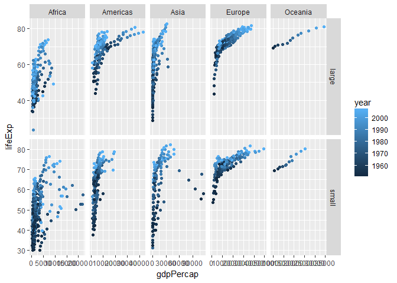
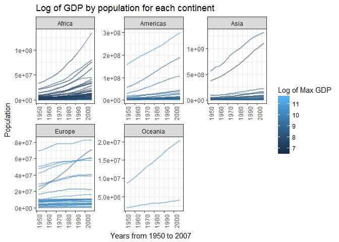

RMarkdown01
================

-   use markdown files for Github
-   ctrl + alt + i to insert a code chunk
-   put a comma after r to set how the run will load

Loading packages

``` r
x <- rnorm(500)
y <- rnorm(500) 

plot (x, y)
```


R Markdown
----------

This is an R Markdown document. Markdown is a simple formatting syntax for authoring HTML, PDF, and MS Word documents. For more details on using R Markdown see <http://rmarkdown.rstudio.com>.

When you click the **Knit** button a document will be generated that includes both content as well as the output of any embedded R code chunks within the document. You can embed an R code chunk like this:

``` r
summary(cars)
```

    ##      speed           dist       
    ##  Min.   : 4.0   Min.   :  2.00  
    ##  1st Qu.:12.0   1st Qu.: 26.00  
    ##  Median :15.0   Median : 36.00  
    ##  Mean   :15.4   Mean   : 42.98  
    ##  3rd Qu.:19.0   3rd Qu.: 56.00  
    ##  Max.   :25.0   Max.   :120.00

Including Plots
---------------

You can also embed plots, for example:

 \#plot run

Note that the `echo = FALSE` parameter was added to the code chunk to prevent printing of the R code that generated the plot.

cm005
-----

``` r
##How many variables (columns) are in the iris dataset, and what are their names?
str(iris)
```

    ## 'data.frame':    150 obs. of  5 variables:
    ##  $ Sepal.Length: num  5.1 4.9 4.7 4.6 5 5.4 4.6 5 4.4 4.9 ...
    ##  $ Sepal.Width : num  3.5 3 3.2 3.1 3.6 3.9 3.4 3.4 2.9 3.1 ...
    ##  $ Petal.Length: num  1.4 1.4 1.3 1.5 1.4 1.7 1.4 1.5 1.4 1.5 ...
    ##  $ Petal.Width : num  0.2 0.2 0.2 0.2 0.2 0.4 0.3 0.2 0.2 0.1 ...
    ##  $ Species     : Factor w/ 3 levels "setosa","versicolor",..: 1 1 1 1 1 1 1 1 1 1 ...

``` r
#How many rows are in the data set?
nrow(iris)
```

    ## [1] 150

``` r
#What are the smallest values of each numeric variable?
summary(iris)
```

    ##   Sepal.Length    Sepal.Width     Petal.Length    Petal.Width   
    ##  Min.   :4.300   Min.   :2.000   Min.   :1.000   Min.   :0.100  
    ##  1st Qu.:5.100   1st Qu.:2.800   1st Qu.:1.600   1st Qu.:0.300  
    ##  Median :5.800   Median :3.000   Median :4.350   Median :1.300  
    ##  Mean   :5.843   Mean   :3.057   Mean   :3.758   Mean   :1.199  
    ##  3rd Qu.:6.400   3rd Qu.:3.300   3rd Qu.:5.100   3rd Qu.:1.800  
    ##  Max.   :7.900   Max.   :4.400   Max.   :6.900   Max.   :2.500  
    ##        Species  
    ##  setosa    :50  
    ##  versicolor:50  
    ##  virginica :50  
    ##                 
    ##                 
    ## 

``` r
#Extract the Petal.Width column to get a vector of observations (we’ll see vectors in more detail in a later class), and
petalwidth <- iris$Petal.Width
#Make a histogram
hist(petalwidth)
```


``` r
#Make a table of frequencies
table(iris$Petal.Width, iris$Species)
```

    ##      
    ##       setosa versicolor virginica
    ##   0.1      5          0         0
    ##   0.2     29          0         0
    ##   0.3      7          0         0
    ##   0.4      7          0         0
    ##   0.5      1          0         0
    ##   0.6      1          0         0
    ##   1        0          7         0
    ##   1.1      0          3         0
    ##   1.2      0          5         0
    ##   1.3      0         13         0
    ##   1.4      0          7         1
    ##   1.5      0         10         2
    ##   1.6      0          3         1
    ##   1.7      0          1         1
    ##   1.8      0          1        11
    ##   1.9      0          0         5
    ##   2        0          0         6
    ##   2.1      0          0         6
    ##   2.2      0          0         3
    ##   2.3      0          0         8
    ##   2.4      0          0         3
    ##   2.5      0          0         3

2.2. dplyr fundamentals

``` r
filter(gapminder, country=="Canada" & year >1970) #use the filter to choose your data
```

    ## # A tibble: 8 x 6
    ##   country continent  year lifeExp      pop gdpPercap
    ##    <fctr>    <fctr> <int>   <dbl>    <int>     <dbl>
    ## 1  Canada  Americas  1972  72.880 22284500  18970.57
    ## 2  Canada  Americas  1977  74.210 23796400  22090.88
    ## 3  Canada  Americas  1982  75.760 25201900  22898.79
    ## 4  Canada  Americas  1987  76.860 26549700  26626.52
    ## 5  Canada  Americas  1992  77.950 28523502  26342.88
    ## 6  Canada  Americas  1997  78.610 30305843  28954.93
    ## 7  Canada  Americas  2002  79.770 31902268  33328.97
    ## 8  Canada  Americas  2007  80.653 33390141  36319.24

``` r
#Find all entries of Canada and Algeria.
filter(gapminder, country %in% c("Canada", "Algeria"))
```

    ## # A tibble: 24 x 6
    ##    country continent  year lifeExp      pop gdpPercap
    ##     <fctr>    <fctr> <int>   <dbl>    <int>     <dbl>
    ##  1 Algeria    Africa  1952  43.077  9279525  2449.008
    ##  2 Algeria    Africa  1957  45.685 10270856  3013.976
    ##  3 Algeria    Africa  1962  48.303 11000948  2550.817
    ##  4 Algeria    Africa  1967  51.407 12760499  3246.992
    ##  5 Algeria    Africa  1972  54.518 14760787  4182.664
    ##  6 Algeria    Africa  1977  58.014 17152804  4910.417
    ##  7 Algeria    Africa  1982  61.368 20033753  5745.160
    ##  8 Algeria    Africa  1987  65.799 23254956  5681.359
    ##  9 Algeria    Africa  1992  67.744 26298373  5023.217
    ## 10 Algeria    Africa  1997  69.152 29072015  4797.295
    ## # ... with 14 more rows

``` r
#Find all entries of Canada and Algeria, occuring in the ’60s.
filter(gapminder, country %in% c("Canada", "Algeria"), year >=1960 & year < 1970)
```

    ## # A tibble: 4 x 6
    ##   country continent  year lifeExp      pop gdpPercap
    ##    <fctr>    <fctr> <int>   <dbl>    <int>     <dbl>
    ## 1 Algeria    Africa  1962  48.303 11000948  2550.817
    ## 2 Algeria    Africa  1967  51.407 12760499  3246.992
    ## 3  Canada  Americas  1962  71.300 18985849 13462.486
    ## 4  Canada  Americas  1967  72.130 20819767 16076.588

``` r
#Find all entries of Canada, and entries of Algeria occuring in the ’60s.
filter(gapminder, (country =="Canada")| (country == "Algeria"& year >=1960 & year < 1970))
```

    ## # A tibble: 14 x 6
    ##    country continent  year lifeExp      pop gdpPercap
    ##     <fctr>    <fctr> <int>   <dbl>    <int>     <dbl>
    ##  1 Algeria    Africa  1962  48.303 11000948  2550.817
    ##  2 Algeria    Africa  1967  51.407 12760499  3246.992
    ##  3  Canada  Americas  1952  68.750 14785584 11367.161
    ##  4  Canada  Americas  1957  69.960 17010154 12489.950
    ##  5  Canada  Americas  1962  71.300 18985849 13462.486
    ##  6  Canada  Americas  1967  72.130 20819767 16076.588
    ##  7  Canada  Americas  1972  72.880 22284500 18970.571
    ##  8  Canada  Americas  1977  74.210 23796400 22090.883
    ##  9  Canada  Americas  1982  75.760 25201900 22898.792
    ## 10  Canada  Americas  1987  76.860 26549700 26626.515
    ## 11  Canada  Americas  1992  77.950 28523502 26342.884
    ## 12  Canada  Americas  1997  78.610 30305843 28954.926
    ## 13  Canada  Americas  2002  79.770 31902268 33328.965
    ## 14  Canada  Americas  2007  80.653 33390141 36319.235

``` r
#also: filter(gapminder, (country =="Canada")| (country == "Algeria"& year %in% 1960:1969)) 

#Find all entries not including European countries.
filter(gapminder, continent != "Europe")
```

    ## # A tibble: 1,344 x 6
    ##        country continent  year lifeExp      pop gdpPercap
    ##         <fctr>    <fctr> <int>   <dbl>    <int>     <dbl>
    ##  1 Afghanistan      Asia  1952  28.801  8425333  779.4453
    ##  2 Afghanistan      Asia  1957  30.332  9240934  820.8530
    ##  3 Afghanistan      Asia  1962  31.997 10267083  853.1007
    ##  4 Afghanistan      Asia  1967  34.020 11537966  836.1971
    ##  5 Afghanistan      Asia  1972  36.088 13079460  739.9811
    ##  6 Afghanistan      Asia  1977  38.438 14880372  786.1134
    ##  7 Afghanistan      Asia  1982  39.854 12881816  978.0114
    ##  8 Afghanistan      Asia  1987  40.822 13867957  852.3959
    ##  9 Afghanistan      Asia  1992  41.674 16317921  649.3414
    ## 10 Afghanistan      Asia  1997  41.763 22227415  635.3414
    ## # ... with 1,334 more rows

select subsets data by columns/variable names.

``` r
select(gapminder, continent, country) #you can use - to remove columns
```

    ## # A tibble: 1,704 x 2
    ##    continent     country
    ##       <fctr>      <fctr>
    ##  1      Asia Afghanistan
    ##  2      Asia Afghanistan
    ##  3      Asia Afghanistan
    ##  4      Asia Afghanistan
    ##  5      Asia Afghanistan
    ##  6      Asia Afghanistan
    ##  7      Asia Afghanistan
    ##  8      Asia Afghanistan
    ##  9      Asia Afghanistan
    ## 10      Asia Afghanistan
    ## # ... with 1,694 more rows

The pipe operator %&gt;% feeds the output of a function into another function

``` r
gapminder %>%  #The pipe operator %>% feeds the output of a function into another function
  filter(country %in% c("Canada", "Algeria"), 
         year <= 1969, year >= 1960) %>% 
  select(country, year, gdpPercap) 
```

    ## # A tibble: 4 x 3
    ##   country  year gdpPercap
    ##    <fctr> <int>     <dbl>
    ## 1 Algeria  1962  2550.817
    ## 2 Algeria  1967  3246.992
    ## 3  Canada  1962 13462.486
    ## 4  Canada  1967 16076.588

``` r
#Exercise: Take all countries in Europe that have a GPD per capita greater than 10000, and select all variables except gdpPercap. (Hint: use -).
gapminder %>%
  filter(continent == "Europe" & gdpPercap > 10000) %>%
  select (-gdpPercap)
```

    ## # A tibble: 214 x 5
    ##    country continent  year lifeExp     pop
    ##     <fctr>    <fctr> <int>   <dbl>   <int>
    ##  1 Austria    Europe  1962  69.540 7129864
    ##  2 Austria    Europe  1967  70.140 7376998
    ##  3 Austria    Europe  1972  70.630 7544201
    ##  4 Austria    Europe  1977  72.170 7568430
    ##  5 Austria    Europe  1982  73.180 7574613
    ##  6 Austria    Europe  1987  74.940 7578903
    ##  7 Austria    Europe  1992  76.040 7914969
    ##  8 Austria    Europe  1997  77.510 8069876
    ##  9 Austria    Europe  2002  78.980 8148312
    ## 10 Austria    Europe  2007  79.829 8199783
    ## # ... with 204 more rows

arrange sorts a data frame by shuffling the order of the rows appropriately. Use desc to sort by descending order.

``` r
arrange(gapminder, desc(pop), desc(lifeExp))
```

    ## # A tibble: 1,704 x 6
    ##    country continent  year  lifeExp        pop gdpPercap
    ##     <fctr>    <fctr> <int>    <dbl>      <int>     <dbl>
    ##  1   China      Asia  2007 72.96100 1318683096 4959.1149
    ##  2   China      Asia  2002 72.02800 1280400000 3119.2809
    ##  3   China      Asia  1997 70.42600 1230075000 2289.2341
    ##  4   China      Asia  1992 68.69000 1164970000 1655.7842
    ##  5   India      Asia  2007 64.69800 1110396331 2452.2104
    ##  6   China      Asia  1987 67.27400 1084035000 1378.9040
    ##  7   India      Asia  2002 62.87900 1034172547 1746.7695
    ##  8   China      Asia  1982 65.52500 1000281000  962.4214
    ##  9   India      Asia  1997 61.76500  959000000 1458.8174
    ## 10   China      Asia  1977 63.96736  943455000  741.2375
    ## # ... with 1,694 more rows

Exercises:

``` r
#Order the data frame by year, then descending by life expectancy.
arrange(gapminder, year, desc(lifeExp))
```

    ## # A tibble: 1,704 x 6
    ##           country continent  year lifeExp      pop gdpPercap
    ##            <fctr>    <fctr> <int>   <dbl>    <int>     <dbl>
    ##  1         Norway    Europe  1952   72.67  3327728 10095.422
    ##  2        Iceland    Europe  1952   72.49   147962  7267.688
    ##  3    Netherlands    Europe  1952   72.13 10381988  8941.572
    ##  4         Sweden    Europe  1952   71.86  7124673  8527.845
    ##  5        Denmark    Europe  1952   70.78  4334000  9692.385
    ##  6    Switzerland    Europe  1952   69.62  4815000 14734.233
    ##  7    New Zealand   Oceania  1952   69.39  1994794 10556.576
    ##  8 United Kingdom    Europe  1952   69.18 50430000  9979.508
    ##  9      Australia   Oceania  1952   69.12  8691212 10039.596
    ## 10         Canada  Americas  1952   68.75 14785584 11367.161
    ## # ... with 1,694 more rows

``` r
#In addition to the above exercise, rearrange the variables so that year comes first, followed by life expectancy. (Hint: check the documentation for the select function for a related handy function).
gapminder %>%
  arrange(year, desc(lifeExp)) %>% 
  select (year, lifeExp, everything())
```

    ## # A tibble: 1,704 x 6
    ##     year lifeExp        country continent      pop gdpPercap
    ##    <int>   <dbl>         <fctr>    <fctr>    <int>     <dbl>
    ##  1  1952   72.67         Norway    Europe  3327728 10095.422
    ##  2  1952   72.49        Iceland    Europe   147962  7267.688
    ##  3  1952   72.13    Netherlands    Europe 10381988  8941.572
    ##  4  1952   71.86         Sweden    Europe  7124673  8527.845
    ##  5  1952   70.78        Denmark    Europe  4334000  9692.385
    ##  6  1952   69.62    Switzerland    Europe  4815000 14734.233
    ##  7  1952   69.39    New Zealand   Oceania  1994794 10556.576
    ##  8  1952   69.18 United Kingdom    Europe 50430000  9979.508
    ##  9  1952   69.12      Australia   Oceania  8691212 10039.596
    ## 10  1952   68.75         Canada  Americas 14785584 11367.161
    ## # ... with 1,694 more rows

Date: 21st September 2017
-------------------------

mutate creates a new variable by calculating from other variables. - transmute works the same way, but drops all other variables.

``` r
mutate(gapminder, 
       gdp = gdpPercap * pop,
       gdpBill = round(gdp/10000000, 1))
```

    ## # A tibble: 1,704 x 8
    ##        country continent  year lifeExp      pop gdpPercap         gdp
    ##         <fctr>    <fctr> <int>   <dbl>    <int>     <dbl>       <dbl>
    ##  1 Afghanistan      Asia  1952  28.801  8425333  779.4453  6567086330
    ##  2 Afghanistan      Asia  1957  30.332  9240934  820.8530  7585448670
    ##  3 Afghanistan      Asia  1962  31.997 10267083  853.1007  8758855797
    ##  4 Afghanistan      Asia  1967  34.020 11537966  836.1971  9648014150
    ##  5 Afghanistan      Asia  1972  36.088 13079460  739.9811  9678553274
    ##  6 Afghanistan      Asia  1977  38.438 14880372  786.1134 11697659231
    ##  7 Afghanistan      Asia  1982  39.854 12881816  978.0114 12598563401
    ##  8 Afghanistan      Asia  1987  40.822 13867957  852.3959 11820990309
    ##  9 Afghanistan      Asia  1992  41.674 16317921  649.3414 10595901589
    ## 10 Afghanistan      Asia  1997  41.763 22227415  635.3414 14121995875
    ## # ... with 1,694 more rows, and 1 more variables: gdpBill <dbl>

``` r
#Exercise: Make a new column called cc that pastes the country name followed by the continent, separated by a comma. (Hint: use the paste function with the sep=", " argument).

mutate(gapminder, country_cont = paste(country, continent, sep = ", "))
```

    ## # A tibble: 1,704 x 7
    ##        country continent  year lifeExp      pop gdpPercap
    ##         <fctr>    <fctr> <int>   <dbl>    <int>     <dbl>
    ##  1 Afghanistan      Asia  1952  28.801  8425333  779.4453
    ##  2 Afghanistan      Asia  1957  30.332  9240934  820.8530
    ##  3 Afghanistan      Asia  1962  31.997 10267083  853.1007
    ##  4 Afghanistan      Asia  1967  34.020 11537966  836.1971
    ##  5 Afghanistan      Asia  1972  36.088 13079460  739.9811
    ##  6 Afghanistan      Asia  1977  38.438 14880372  786.1134
    ##  7 Afghanistan      Asia  1982  39.854 12881816  978.0114
    ##  8 Afghanistan      Asia  1987  40.822 13867957  852.3959
    ##  9 Afghanistan      Asia  1992  41.674 16317921  649.3414
    ## 10 Afghanistan      Asia  1997  41.763 22227415  635.3414
    ## # ... with 1,694 more rows, and 1 more variables: country_cont <chr>

summarize reduces a tibble according to summary statistics.

``` r
summarize(gapminder, mean_pop=mean(pop), sd_pop=sd(pop))
```

    ## # A tibble: 1 x 2
    ##   mean_pop    sd_pop
    ##      <dbl>     <dbl>
    ## 1 29601212 106157897

``` r
gapminder %>% 
    group_by(continent) %>% 
    summarize(mean_pop=mean(pop), sd_pop=sd(pop))
```

    ## # A tibble: 5 x 3
    ##   continent mean_pop    sd_pop
    ##      <fctr>    <dbl>     <dbl>
    ## 1    Africa  9916003  15490923
    ## 2  Americas 24504795  50979430
    ## 3      Asia 77038722 206885205
    ## 4    Europe 17169765  20519438
    ## 5   Oceania  8874672   6506342

``` r
group_by(gapminder, year<1970)
```

    ## # A tibble: 1,704 x 7
    ## # Groups:   year < 1970 [2]
    ##        country continent  year lifeExp      pop gdpPercap `year < 1970`
    ##         <fctr>    <fctr> <int>   <dbl>    <int>     <dbl>         <lgl>
    ##  1 Afghanistan      Asia  1952  28.801  8425333  779.4453          TRUE
    ##  2 Afghanistan      Asia  1957  30.332  9240934  820.8530          TRUE
    ##  3 Afghanistan      Asia  1962  31.997 10267083  853.1007          TRUE
    ##  4 Afghanistan      Asia  1967  34.020 11537966  836.1971          TRUE
    ##  5 Afghanistan      Asia  1972  36.088 13079460  739.9811         FALSE
    ##  6 Afghanistan      Asia  1977  38.438 14880372  786.1134         FALSE
    ##  7 Afghanistan      Asia  1982  39.854 12881816  978.0114         FALSE
    ##  8 Afghanistan      Asia  1987  40.822 13867957  852.3959         FALSE
    ##  9 Afghanistan      Asia  1992  41.674 16317921  649.3414         FALSE
    ## 10 Afghanistan      Asia  1997  41.763 22227415  635.3414         FALSE
    ## # ... with 1,694 more rows

``` r
(out1 <- gapminder %>% 
    group_by(continent, year < 1970) %>% 
    summarize(mean_pop=mean(pop), sd_pop=sd(pop)))
```

    ## # A tibble: 10 x 4
    ## # Groups:   continent [?]
    ##    continent `year < 1970` mean_pop    sd_pop
    ##       <fctr>         <lgl>    <dbl>     <dbl>
    ##  1    Africa         FALSE 12147359  17783750
    ##  2    Africa          TRUE  5453291   7625960
    ##  3  Americas         FALSE 28526576  56403222
    ##  4  Americas          TRUE 16461232  36829335
    ##  5      Asia         FALSE 90709000 234592299
    ##  6      Asia          TRUE 49698167 132064025
    ##  7    Europe         FALSE 18264875  21581017
    ##  8    Europe          TRUE 14979544  18098838
    ##  9   Oceania         FALSE 10155014   7136552
    ## 10   Oceania          TRUE  6313989   4326110

``` r
#Exercise: Find the minimum GDP per capita experienced by each country
(out2 <- gapminder %>% 
    group_by(country) %>% 
    summarize(min.gdp=min(gdpPercap)))
```

    ## # A tibble: 142 x 2
    ##        country    min.gdp
    ##         <fctr>      <dbl>
    ##  1 Afghanistan   635.3414
    ##  2     Albania  1601.0561
    ##  3     Algeria  2449.0082
    ##  4      Angola  2277.1409
    ##  5   Argentina  5911.3151
    ##  6   Australia 10039.5956
    ##  7     Austria  6137.0765
    ##  8     Bahrain  9867.0848
    ##  9  Bangladesh   630.2336
    ## 10     Belgium  8343.1051
    ## # ... with 132 more rows

``` r
#Exercise: How many years of record does each country have?
(out3 <- gapminder %>% 
    group_by(country) %>% 
    summarize(nyear = n_distinct(year)))
```

    ## # A tibble: 142 x 2
    ##        country nyear
    ##         <fctr> <int>
    ##  1 Afghanistan    12
    ##  2     Albania    12
    ##  3     Algeria    12
    ##  4      Angola    12
    ##  5   Argentina    12
    ##  6   Australia    12
    ##  7     Austria    12
    ##  8     Bahrain    12
    ##  9  Bangladesh    12
    ## 10     Belgium    12
    ## # ... with 132 more rows

``` r
#Exercise: Within Asia, what are the min and max life expectancies experienced in each year?
gapminder%>%
  filter(continent == "Asia") %>%
  group_by(year) %>%
    summarize (miexp = min(lifeExp), (maxexp = max(lifeExp)))
```

    ## # A tibble: 12 x 3
    ##     year  miexp `(maxexp = max(lifeExp))`
    ##    <int>  <dbl>                     <dbl>
    ##  1  1952 28.801                    65.390
    ##  2  1957 30.332                    67.840
    ##  3  1962 31.997                    69.390
    ##  4  1967 34.020                    71.430
    ##  5  1972 36.088                    73.420
    ##  6  1977 31.220                    75.380
    ##  7  1982 39.854                    77.110
    ##  8  1987 40.822                    78.670
    ##  9  1992 41.674                    79.360
    ## 10  1997 41.763                    80.690
    ## 11  2002 42.129                    82.000
    ## 12  2007 43.828                    82.603

cm006
-----

Using ggplot

``` r
p <- ggplot(gapminder, aes(x=year, y=lifeExp))
p + geom_point(alpha = .25)
```


``` r
#Exercises:

#Make a scatterplot of gdpPercap vs lifeExp. Store it in a variable called p2.
p2 <- ggplot(gapminder, aes(x = gdpPercap, y = lifeExp))
p2 + geom_point()
```


``` r
#To p2, make the size of the points indicate the year, choose a level of alpha transparency that you’re happy with, and make the points your favourite colour.
p2 + geom_point(aes(size =year), alpha = .15, colour = "blue")
```


``` r
#To p2, colour the points by continent. but this time with year being represented by the size of the points.
p2 + geom_point(aes(size=year, colour = continent), alpha = .15)
```


``` r
#To p2, add another layer called scale_x_log10(). Make a second plot by redoing the plot in (1), but replacing gdpPercap with log10(gdpPercap). What do you notice?
#p3 <- ggplot(gapminder, aes(x = log10(gdpPercap), y = lifeExp))
ggplot(gapminder, aes(x = log10(gdpPercap), y = lifeExp)) + geom_point(aes(colour= continent)) + scale_x_log10()
```


cm007
=====

Facetting
---------

``` r
ggplot(gapminder, aes(gdpPercap, lifeExp)) +
    geom_point(aes(colour=continent))
```


#### facet\_wrap: 1D facetting – we’ll focus on this first.

#### facet\_grid: 2D facetting

``` r
ggplot(gapminder, aes(gdpPercap, lifeExp)) +
    facet_wrap(~ continent, scales = "free", ncol = 3, labeller = "label_both") + #scales and ncol used
    geom_point()
```


Exercise 4: Make a plot of year (x) vs lifeExp (y), facetted by continent. Then, fit a smoother through the data for each continent, without the error bars. Choose a span that you feel is appropriate.

``` r
ggplot(gapminder, aes(y=lifeExp, x= year)) + 
  facet_wrap(~continent) +
  geom_point() + 
  geom_smooth(se = FALSE, span = 1, method="loess") #span only works with method="loess"
```


facet\_grid puts the panels in a grid.

``` r
vc2 <- gapminder %>% 
    mutate(size=ifelse(pop > 7000000, "large", "small")) %>% #facet by “small” (<=7,000,000 population) and “large” (>7,000,000 population) countries. 
    ggplot(aes(gdpPercap, lifeExp)) +
    facet_grid(size ~ continent, scales = "free" ) 
vc2 + geom_point(aes(colour=year)) #also try colour = continent
```



``` r
vc2 + 
    geom_point(colour="red",
               alpha=0.2) +
    geom_smooth() +
    scale_x_log10()
```

    ## `geom_smooth()` using method = 'loess'


#### Connect the dots with geom\_line

geom\_line: connect the dots from left-to-right. geom\_path: connect the dots in the order that they appear in the data frame.

``` r
ggplot(gapminder, aes(year, lifeExp, group = country)) + # make sure you specify group
    geom_line(alpha = .5, aes(colour = continent))
```


``` r
gapminder %>%
    filter(country=="Bangladesh") %>% 
    arrange(year) %>% 
    ggplot(aes(pop, gdpPercap)) +
    geom_point() +
    geom_text(aes(label = year, hjust = 1.5))+
    geom_path()
```


Exercise 5: Plot the population over time (year) using lines, so that each country has its own line. Colour by gdpPercap. Add alpha transparency to your liking.

``` r
ggplot(gapminder, aes(y=pop, x= year, group = country, colour = gdpPercap)) +
  geom_line(alpha = .5)
```

 Exercise 6: Add points to the plot in Exercise 5.

``` r
gapminder %>%
  ggplot(aes(y=pop, x= year, group = country, colour = gdpPercap))+
  scale_y_log10() +
  geom_point() +
  geom_line()
```


cm008
=====

Linear Regression
-----------------

lm(y ~ x1 + x2 + ... + xp, data=your\_data\_frame)

``` r
fit1 =  lm(lifeExp ~ log(gdpPercap), data = gapminder)
fit1
```

    ## 
    ## Call:
    ## lm(formula = lifeExp ~ log(gdpPercap), data = gapminder)
    ## 
    ## Coefficients:
    ##    (Intercept)  log(gdpPercap)  
    ##         -9.101           8.405

``` r
fit1_small <- lm(lifeExp ~ log(gdpPercap), data=head(gapminder))
lapply(fit1_small, identity) 
```

    ## $coefficients
    ##    (Intercept) log(gdpPercap) 
    ##      187.61570      -23.08098 
    ## 
    ## $residuals
    ##          1          2          3          4          5          6 
    ## -5.1280595 -2.4023520  0.1520397  1.7131151  0.9597015  4.7055553 
    ## 
    ## $effects
    ##    (Intercept) log(gdpPercap)                                              
    ##     -81.517386       2.710390       2.070161       3.508404       2.004734 
    ##                
    ##       6.121766 
    ## 
    ## $rank
    ## [1] 2
    ## 
    ## $fitted.values
    ##        1        2        3        4        5        6 
    ## 33.92906 32.73435 31.84496 32.30688 35.12830 33.73244 
    ## 
    ## $assign
    ## [1] 0 1
    ## 
    ## $qr
    ## $qr
    ##   (Intercept) log(gdpPercap)
    ## 1  -2.4494897    -16.3790824
    ## 2   0.4082483     -0.1174296
    ## 3   0.4082483      0.5987063
    ## 4   0.4082483      0.4282789
    ## 5   0.4082483     -0.6126834
    ## 6   0.4082483     -0.0976823
    ## attr(,"assign")
    ## [1] 0 1
    ## 
    ## $qraux
    ## [1] 1.408248 1.270565
    ## 
    ## $pivot
    ## [1] 1 2
    ## 
    ## $tol
    ## [1] 1e-07
    ## 
    ## $rank
    ## [1] 2
    ## 
    ## attr(,"class")
    ## [1] "qr"
    ## 
    ## $df.residual
    ## [1] 4
    ## 
    ## $xlevels
    ## named list()
    ## 
    ## $call
    ## lm(formula = lifeExp ~ log(gdpPercap), data = head(gapminder))
    ## 
    ## $terms
    ## lifeExp ~ log(gdpPercap)
    ## attr(,"variables")
    ## list(lifeExp, log(gdpPercap))
    ## attr(,"factors")
    ##                log(gdpPercap)
    ## lifeExp                     0
    ## log(gdpPercap)              1
    ## attr(,"term.labels")
    ## [1] "log(gdpPercap)"
    ## attr(,"order")
    ## [1] 1
    ## attr(,"intercept")
    ## [1] 1
    ## attr(,"response")
    ## [1] 1
    ## attr(,".Environment")
    ## <environment: R_GlobalEnv>
    ## attr(,"predvars")
    ## list(lifeExp, log(gdpPercap))
    ## attr(,"dataClasses")
    ##        lifeExp log(gdpPercap) 
    ##      "numeric"      "numeric" 
    ## 
    ## $model
    ##   lifeExp log(gdpPercap)
    ## 1  28.801       6.658583
    ## 2  30.332       6.710344
    ## 3  31.997       6.748878
    ## 4  34.020       6.728864
    ## 5  36.088       6.606625
    ## 6  38.438       6.667101

``` r
predict(fit1) %>% head
```

    ##        1        2        3        4        5        6 
    ## 46.86506 47.30012 47.62400 47.45579 46.42835 46.93666

``` r
qplot(log(gapminder$gdpPercap), predict(fit1))
```


``` r
ggplot(gapminder, aes(gdpPercap, lifeExp)) +
    geom_point(alpha=0.3) +
    geom_point(y=predict(fit1), colour="blue") + #you can also use geom_smooth(method ="lm") to draw the line but you can't get the regression coefficients from ggplot, for that you need lm
    scale_x_log10()
```


``` r
my_newdata <- data.frame(gdpPercap=c(100, 547, 289))
predict(fit1, newdata=my_newdata)
```

    ##        1        2        3 
    ## 29.60596 43.88854 38.52591

``` r
predict(fit1, newdata=filter(gapminder, country=="Canada"))
```

    ##        1        2        3        4        5        6        7        8 
    ## 69.38986 70.18158 70.81182 72.30336 73.69461 74.97451 75.27641 76.54409 
    ##        9       10       11       12 
    ## 76.45408 77.24871 78.43120 79.15337

``` r
fit1$coefficients # also can use coef(fit1) to find coefficients
```

    ##    (Intercept) log(gdpPercap) 
    ##      -9.100889       8.405085

``` r
fit1$residuals %>% head # also can use resid(fit1) %>% head to find residuals
```

    ##          1          2          3          4          5          6 
    ## -18.064063 -16.968123 -15.627000 -13.435788 -10.340352  -8.498661

``` r
# fit1$effects
# fit1$fitted.values
# fit1$qr
# fit1$call 
# fit1$model
```

``` r
qplot(log(gapminder$gdpPercap), resid(fit1)) +
    geom_hline(yintercept=0,
               linetype="dashed") #you can add a horizontal line at any point using geom_hline
```


``` r
summ_fit1 <- summary(fit1)
summ_fit1$r.squared
```

    ## [1] 0.6522466

``` r
summ_fit1$adj.r.squared
```

    ## [1] 0.6520423

``` r
summ_fit1$sigma   # standard deviation
```

    ## [1] 7.619535

``` r
?summary.lm # search for summary.lm documentation for all the variables included in the summary of class lm
```

    ## starting httpd help server ... done

``` r
?summary.glm
```

For GLM \#\# Poisson regression: glm(y ~ x1 + x2 + ... + xp, family=poisson, data=your\_data\_frame) \#\# Logistic (aka Binomial) regression: glm(y ~ x1 + x2 + ... + xp, family=binomial, data=your\_data\_frame)

dplyr
=====

``` r
gapminder %>%
    group_by(continent) %>% 
    summarize(mean_gdpPercap = mean(gdpPercap),
              n_countries    = length(gdpPercap))
```

    ## # A tibble: 5 x 3
    ##   continent mean_gdpPercap n_countries
    ##      <fctr>          <dbl>       <int>
    ## 1    Africa       2193.755         624
    ## 2  Americas       7136.110         300
    ## 3      Asia       7902.150         396
    ## 4    Europe      14469.476         360
    ## 5   Oceania      18621.609          24

#### Calculating growth since the first record - pop\[1\]

``` r
gapminder %>% 
    group_by(country) %>%  # need to group so that R knows how to group to calculate things
    arrange(year) %>%      # should arrange the years so that row 1 is 1952
    mutate(pop_growth = pop - pop[1])
```

    ## # A tibble: 1,704 x 7
    ## # Groups:   country [142]
    ##        country continent  year lifeExp      pop  gdpPercap pop_growth
    ##         <fctr>    <fctr> <int>   <dbl>    <int>      <dbl>      <int>
    ##  1 Afghanistan      Asia  1952  28.801  8425333   779.4453          0
    ##  2     Albania    Europe  1952  55.230  1282697  1601.0561          0
    ##  3     Algeria    Africa  1952  43.077  9279525  2449.0082          0
    ##  4      Angola    Africa  1952  30.015  4232095  3520.6103          0
    ##  5   Argentina  Americas  1952  62.485 17876956  5911.3151          0
    ##  6   Australia   Oceania  1952  69.120  8691212 10039.5956          0
    ##  7     Austria    Europe  1952  66.800  6927772  6137.0765          0
    ##  8     Bahrain      Asia  1952  50.939   120447  9867.0848          0
    ##  9  Bangladesh      Asia  1952  37.484 46886859   684.2442          0
    ## 10     Belgium    Europe  1952  68.000  8730405  8343.1051          0
    ## # ... with 1,694 more rows

How about growth compared to 2007?

``` r
gapminder %>% 
    group_by(country) %>% 
    mutate(pop_growth = pop[year==2007] - pop)
```

    ## # A tibble: 1,704 x 7
    ## # Groups:   country [142]
    ##        country continent  year lifeExp      pop gdpPercap pop_growth
    ##         <fctr>    <fctr> <int>   <dbl>    <int>     <dbl>      <int>
    ##  1 Afghanistan      Asia  1952  28.801  8425333  779.4453   23464590
    ##  2 Afghanistan      Asia  1957  30.332  9240934  820.8530   22648989
    ##  3 Afghanistan      Asia  1962  31.997 10267083  853.1007   21622840
    ##  4 Afghanistan      Asia  1967  34.020 11537966  836.1971   20351957
    ##  5 Afghanistan      Asia  1972  36.088 13079460  739.9811   18810463
    ##  6 Afghanistan      Asia  1977  38.438 14880372  786.1134   17009551
    ##  7 Afghanistan      Asia  1982  39.854 12881816  978.0114   19008107
    ##  8 Afghanistan      Asia  1987  40.822 13867957  852.3959   18021966
    ##  9 Afghanistan      Asia  1992  41.674 16317921  649.3414   15572002
    ## 10 Afghanistan      Asia  1997  41.763 22227415  635.3414    9662508
    ## # ... with 1,694 more rows

#### Growth compared to the last years pop

``` r
gapminder %>% 
    group_by(country) %>% 
    mutate(pop_growth = pop - lag(pop))
```

    ## # A tibble: 1,704 x 7
    ## # Groups:   country [142]
    ##        country continent  year lifeExp      pop gdpPercap pop_growth
    ##         <fctr>    <fctr> <int>   <dbl>    <int>     <dbl>      <int>
    ##  1 Afghanistan      Asia  1952  28.801  8425333  779.4453         NA
    ##  2 Afghanistan      Asia  1957  30.332  9240934  820.8530     815601
    ##  3 Afghanistan      Asia  1962  31.997 10267083  853.1007    1026149
    ##  4 Afghanistan      Asia  1967  34.020 11537966  836.1971    1270883
    ##  5 Afghanistan      Asia  1972  36.088 13079460  739.9811    1541494
    ##  6 Afghanistan      Asia  1977  38.438 14880372  786.1134    1800912
    ##  7 Afghanistan      Asia  1982  39.854 12881816  978.0114   -1998556
    ##  8 Afghanistan      Asia  1987  40.822 13867957  852.3959     986141
    ##  9 Afghanistan      Asia  1992  41.674 16317921  649.3414    2449964
    ## 10 Afghanistan      Asia  1997  41.763 22227415  635.3414    5909494
    ## # ... with 1,694 more rows

Vectorized Functions: These take a vector, and operate on each component independently to return a vector of the same length. In other words, they work element-wise. Examples are cos, sin, log, exp, round. We don’t need to group\_by in order to mutate with these. Aggregate Functions: These take a vector, and return a vector of length 1 – as if “aggregating” the values in the vector into a single value. Examples are mean, sd, length, typeof. We use these in dplyr’s summarise function. Window Functions: these take a vector, and return a vector of the same length that depends on other values in the vector. Examples are lag, rank, cumsum. See the window-functions vignette for the dplyr package.

ggplot
------

### Themes:

theme\_grey \#default theme\_gray theme\_bw \#this is nice theme\_linedraw theme\_light \#this is nice theme\_dark theme\_minimal \#this is nice theme\_classic theme\_void theme\_test

The arguments of theme follow a naming convention: general.to.specific axis.title axis.title.x

``` r
p1 <- ggplot(gapminder, aes(gdpPercap, lifeExp)) +
    facet_wrap(~ continent) +
    geom_point(colour="#386CB0", alpha=0.2) +
    scale_x_log10()
p1 + theme_bw()
```


element\_blank (basically means replace with “nothing”) element\_rect: allows us to specify features of a rectangle. element\_line: allows us to specify features of a line. element\_text: allows us to specify font.

``` r
p1 + theme_bw()+
    theme(strip.background = element_rect(fill="yellow"),
          axis.title = element_text(size=14),
          strip.text = element_text(size=14, face="bold"))
```


### Modifying scales

[link to a tutorial](https://github.com/hadley/ggplot2-book/blob/master/scales.rmd)

-   scale\_x\_continuous
-   scale\_colour\_discrete
-   scale\_y\_sqrt

``` r
p1 + labs(x="GDP per capita", 
          y="Life Expectancy",
          title="A Plot of the World")
```


``` r
ggplot(gapminder, aes(gdpPercap, lifeExp)) +
    geom_point(aes(colour=continent),
               alpha=0.2) +
  scale_colour_discrete("Continents of\n the World") # \n is for a new line
```

 breaks specify where along the scale you’d like to display a value.

``` r
## Log lines:
p1 + scale_x_log10(breaks=c((1:10)*1000,
                            (1:10)*10000))
```

    ## Scale for 'x' is already present. Adding another scale for 'x', which
    ## will replace the existing scale.


``` r
## Scale for 'x' is already present. Adding another scale for 'x', which
## will replace the existing scale.
```

``` r
p2 <- ggplot(gapminder, aes(gdpPercap, lifeExp)) +
    geom_point(aes(colour=pop/10^9),
               alpha=0.5)
## Default breaks
p2 + scale_x_log10(breaks=c((1:10)*1000,
                            (1:10)*10000)) + 
  scale_colour_continuous("Population\nin billions")
```


``` r
## Discrete scale:
ggplot(gapminder, aes(gdpPercap, lifeExp)) +
    geom_point(aes(colour=continent),
               alpha=0.2) +
    scale_colour_discrete(labels=c("Af", "Am", "As", "Eu", "Oc"))
```


Exercises
---------

**Exercise 1:** Suppose we want to calculate some quantity for each country in the gapminder data set. For each of the following quantities, indicate whether the function is vectorized, aggregate, or window, and use dplyr functions to calculate the specified variable.

i.e., the value that appears for 1962 would be the gdpPercap in 1957 (the previous entry). Hint: use the lag function, then filter out the NA’s created with the is.na function.

``` r
# The change in population from 1962 to 1972.
gapminder %>%
  filter(year %in% c("1962", "1972")) %>%
  group_by(country) %>%
  mutate(popchange62 = pop[year == 1962] - pop[year == 1972]) %>%
  filter(year == 1972)
```

    ## # A tibble: 142 x 7
    ## # Groups:   country [142]
    ##        country continent  year lifeExp      pop  gdpPercap popchange62
    ##         <fctr>    <fctr> <int>   <dbl>    <int>      <dbl>       <int>
    ##  1 Afghanistan      Asia  1972  36.088 13079460   739.9811    -2812377
    ##  2     Albania    Europe  1972  67.690  2263554  3313.4222     -535417
    ##  3     Algeria    Africa  1972  54.518 14760787  4182.6638    -3759839
    ##  4      Angola    Africa  1972  37.928  5894858  5473.2880    -1068843
    ##  5   Argentina  Americas  1972  67.065 24779799  9443.0385    -3496016
    ##  6   Australia   Oceania  1972  71.930 13177000 16788.6295    -2382032
    ##  7     Austria    Europe  1972  70.630  7544201 16661.6256     -414337
    ##  8     Bahrain      Asia  1972  63.300   230800 18268.6584      -58937
    ##  9  Bangladesh      Asia  1972  45.252 70759295   630.2336   -13920006
    ## 10     Belgium    Europe  1972  71.440  9709100 16672.1436     -490700
    ## # ... with 132 more rows

``` r
## alternative
gapminder %>%
  filter(year %in% c("1962", "1972")) %>%
           arrange(year) %>%
           group_by(country) %>%
                      summarize(pop_change = diff(pop))
```

    ## # A tibble: 142 x 2
    ##        country pop_change
    ##         <fctr>      <int>
    ##  1 Afghanistan    2812377
    ##  2     Albania     535417
    ##  3     Algeria    3759839
    ##  4      Angola    1068843
    ##  5   Argentina    3496016
    ##  6   Australia    2382032
    ##  7     Austria     414337
    ##  8     Bahrain      58937
    ##  9  Bangladesh   13920006
    ## 10     Belgium     490700
    ## # ... with 132 more rows

``` r
# The population, in billions.
gapminder %>%
  transmute(country, continent, popbil = pop/10^9)
```

    ## # A tibble: 1,704 x 3
    ##        country continent      popbil
    ##         <fctr>    <fctr>       <dbl>
    ##  1 Afghanistan      Asia 0.008425333
    ##  2 Afghanistan      Asia 0.009240934
    ##  3 Afghanistan      Asia 0.010267083
    ##  4 Afghanistan      Asia 0.011537966
    ##  5 Afghanistan      Asia 0.013079460
    ##  6 Afghanistan      Asia 0.014880372
    ##  7 Afghanistan      Asia 0.012881816
    ##  8 Afghanistan      Asia 0.013867957
    ##  9 Afghanistan      Asia 0.016317921
    ## 10 Afghanistan      Asia 0.022227415
    ## # ... with 1,694 more rows

``` r
# The lagged gdpPercap
gapminder %>%
  group_by(country) %>%
  mutate(gdpgrowth = gdpPercap - lag(gdpPercap))
```

    ## # A tibble: 1,704 x 7
    ## # Groups:   country [142]
    ##        country continent  year lifeExp      pop gdpPercap  gdpgrowth
    ##         <fctr>    <fctr> <int>   <dbl>    <int>     <dbl>      <dbl>
    ##  1 Afghanistan      Asia  1952  28.801  8425333  779.4453         NA
    ##  2 Afghanistan      Asia  1957  30.332  9240934  820.8530   41.40772
    ##  3 Afghanistan      Asia  1962  31.997 10267083  853.1007   32.24768
    ##  4 Afghanistan      Asia  1967  34.020 11537966  836.1971  -16.90357
    ##  5 Afghanistan      Asia  1972  36.088 13079460  739.9811  -96.21603
    ##  6 Afghanistan      Asia  1977  38.438 14880372  786.1134   46.13225
    ##  7 Afghanistan      Asia  1982  39.854 12881816  978.0114  191.89808
    ##  8 Afghanistan      Asia  1987  40.822 13867957  852.3959 -125.61549
    ##  9 Afghanistan      Asia  1992  41.674 16317921  649.3414 -203.05455
    ## 10 Afghanistan      Asia  1997  41.763 22227415  635.3414  -14.00004
    ## # ... with 1,694 more rows

**Exercise 2:** For the gapminder dataset, make a spaghetti plot showing the population trend (in millions) over time for each country, facetted by continent. Make as many of the following modifications as you can:

``` r
data2 <- gapminder %>%
  group_by(country) %>%
  mutate(logmaxgdp = log(max(gdpPercap)))
```

-   \[X\] Colour each line by the log maximum gdpPercap experienced by the country.
-   \[X\] Rotate the x-axis labels to be vertical.
-   \[ \] Remove the x-axis title.
-   \[ \] Give the legend an appropriate title.
-   \[ \] Put the y-axis on a log-scale.
-   \[ \] Rename the y-axis title.
-   \[ \] Add more numbers along the y-axis.
-   \[ \] Give the plot a title, and center the title.
-   \[ \] Only label the x axis with years 1950, 1975, and 2000.
-   \[ \] Move the colour scale to the bottom.
-   \[ \] Rename the colour legend

``` r
plot2 <- ggplot(data2, aes(x= year, y = pop, group = country, colour = logmaxgdp)) #Colour each line by the log maximum gdpPercap experienced by the country
plot2 + geom_line(size = 1, alpha = .5) + 
  facet_wrap( ~ continent, scales = "free") + 
  theme_bw() +
  theme(axis.text.x = element_text(angle = 90)) + # Rotate the x-axis labels to be vertical.
  scale_fill_discrete(name = "log") + 
  ggtitle("Log of GDP by population for each continent") + #title
  labs(x = "Years from 1950 to 2007", y = "Population", colour = "Log of Max GDP") # adds axis & legend labels
```


